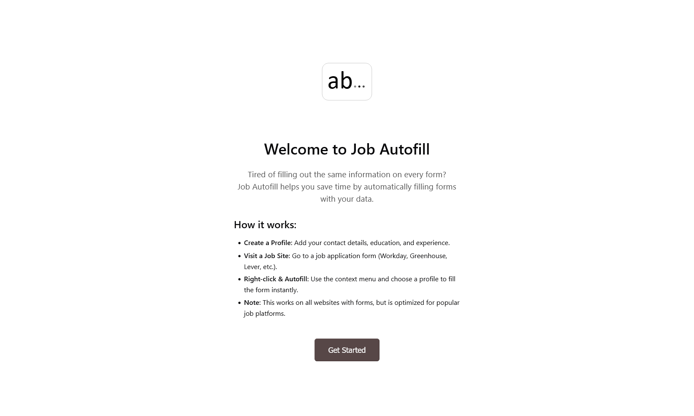
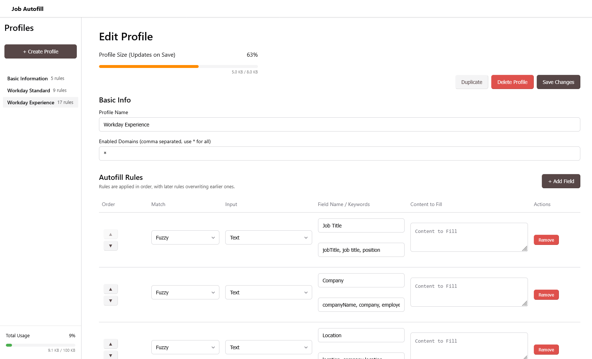

# Job Autofill

<div align="center">



A browser extension for managing and autofilling job application forms.

</div>

|  |  |
| :-----------------------------------------: | :---------------------------------------: |

> [!IMPORTANT]  
> This is a learning experiment and for my personal use.  
> Not intended for public use. **Use at your own risk.**  
> The code is made available for critique, as-is, without any warranties.  
> Feature requests are _highly likely_ to be ignored.

Available on Firefox and Chromium-based browsers.

[  ](https://github.com/kitswas/job-autofill/releases)

[](https://addons.mozilla.org/en-GB/firefox/addon/job-autofill/)

## Features

- **Profile Dashboard**: Manage multiple application profiles in a full-page interface.
- **Dynamic Rules**: Define custom keywords to match form fields for flexible autofilling.
- **Context Menu**: Right-click any input to fill using a specific profile.
- **Privacy First**: All data is stored locally via `browser.storage`.

## Project Structure

- `apps/extension`: The core browser extension (Background & Content scripts).
- `apps/popup-ui`: React-based management dashboard.
- `packages/core`: Shared TypeScript logic and matching engine.

## Development

### Prerequisites

- [Node.js (LTS, use nvm to manage node versions)](https://nodejs.org/)
- [pnpm](https://pnpm.io/)

### Setup

```bash
pnpm install -r
pnpm build:core
```

### Dashboard UI Development (with HMR)

```bash
pnpm dev:popup
```

_The dashboard includes a mock storage layer for debugging in a standard browser tab._

### Building the Extension

```bash
pnpm build
```

The final extension will be available in `apps/extension/dist`.

### Automated End-to-End Testing

Uses Playwright, tests on Firefox and Chromium.

```bash
pnpm test:e2e
# To see test results in a browser:
pnpm test:e2e:report
```

### Launch Browser for Testing (Manual)

```bash
pnpm launch
```

This starts a test server and runs the extension using `web-ext`.

### Dependency Graph


